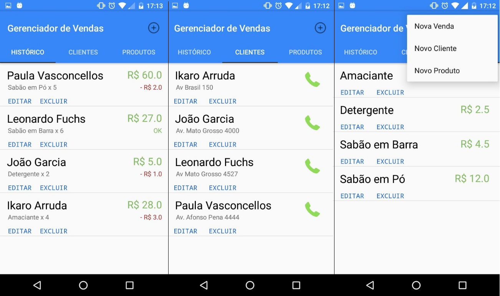

<h1 align="center">
    Gerenciador de Vendas [Sales Manager]
</h1>

<h2 align="center">
    Desenvolvido durante o meu período na EngeFour Jr.
</h2>

    
    
    
    

### Resumo

Aplicativo desenvolvido em Android pela [EngeFour Júnior](https://www.instagram.com/engefourjunior/) com o objetivo de atender uma demanda específica. A ideia foi disponibilizar um local prático e seguro onde vendedores autônomos informais pudessem gerenciar suas vendas, auxiliando o seu controle de estoque e os seus ganhos. Por se tratar de um projeto que foi desenvolvido visando o aprendizado dos desenvolvedores envolvidos, seu custo foi irrisório para o cliente e seu código foi disponibilizado de maneira completa, utilizando a licença MIT. 

### EngeFour Jr.

Fundada em Maio de 2015, a EngeFour Júnior é uma empresa júnior multidisciplinar sem fins lucrativos residente na Universidade Federal de Mato Grosso do Sul. Formada exclusivamente por alunos de graduação e auxiliados por docentes das áreas de atuação da empresa, possui como principal missão oferecer soluções em projetos nas mais diversas áreas relacionadas à engenharia, prezando pela qualidade e eficiência nos serviços, buscando sempre a inovação. A proposta da empresa júnior EngeFour Jr. é acrescentar à formação dos alunos o conhecimento prático, que ainda é pouco desenvolvido. Através de trabalhos e projetos a mesma proporcionará o crescimento profissional e pessoal de seus colaboradores, trazendo para os cursos integrantes e para a Universidade o reconhecimento que merecem. Além disso a EngeFour busca fomentar características de liderança, trabalho em equipe, tomada de decisão e a cultura do empreendedorismo. Trabalhar com consultorias e projetos com enfâse em Engenharia, buscando oferecer até mesmo às empresas menos favorecidas financeiramente, serviços e projetos realizados com excelência, supervisionados e auxiliados por professores especialistas.

### Imagens e Download

Algumas imagens com exemplos da aplicação em funcionamento estão disponibilizadas abaixo:

    

Além deste repositório, o aplicativo se encontra também na Google Play, e seu download pode ser realizado de maneira gratuita no seguinte link:

[Download Google Play](https://play.google.com/store/apps/details?id=com.engefour.gerirvendas&hl=pt_BR)

